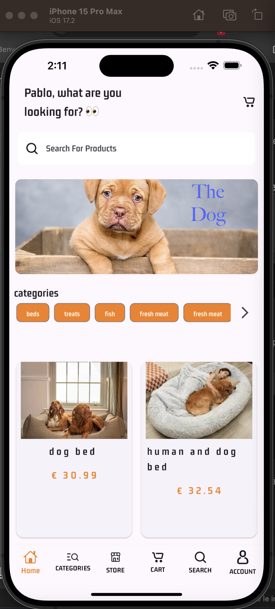
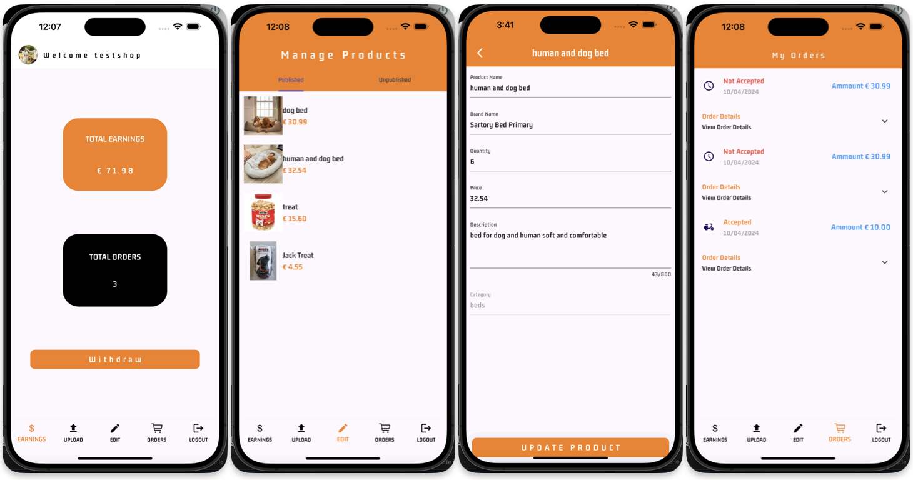

# Flutter E-commerce Examples

## Description
This repository contains two types of e-commerce applications built with Flutter: a single-vendor application and a multi-vendor application. These files are copies of the original ones, and for security and privacy reasons, all references to Firebase API keys and Google service files have been deleted.

## Functionality
- **Single-Vendor Application:** Supports multiple languages, includes a social feature with chat and posts, allows adding products to cart and favorites using Provider, checkout functionality, etc.
    

- **Multi-Vendor Application:** Allows signing in or signing up as a vendor or buyer. The application will display:
    - **Buyer Side:** Add items to cart, filter products by category or store, view orders, edit profile, etc.
    

    - **Vendor Side:** Add new products, edit existing products, choose whether to publish or unpublish them, view orders, etc.
    

## Prerequisites
This project is a starting point for a Flutter E-commerce application.

A few resources to get you started if this is your first Flutter project:

- [Lab: Write your first Flutter app](https://docs.flutter.dev/get-started/codelab)
- [Cookbook: Useful Flutter samples](https://docs.flutter.dev/cookbook)

For help getting started with Flutter development, view the
[online documentation](https://docs.flutter.dev/), which offers tutorials,
samples, guidance on mobile development, and a full API reference.

Ensure the following are installed:
- [Flutter](https://flutter.dev/docs/get-started/install)
- [Dart](https://dart.dev/get-dart)

### Setup Firebase
Set up your Firebase project, compile it in the correct locations with your API keys:
- Update the following files:
  - `lib/main.dart`
  - `lib/firebase_options.dart`
- Add the Google service files in the appropriate directories:
  - `android/app/google-services.json`
  - `ios/Runner/GoogleService-Info.plist`

## Installation
1. Clone the repository:
   ```bash
   git clone https://github.com/YourUsername/Flutter_E-commerces.git
